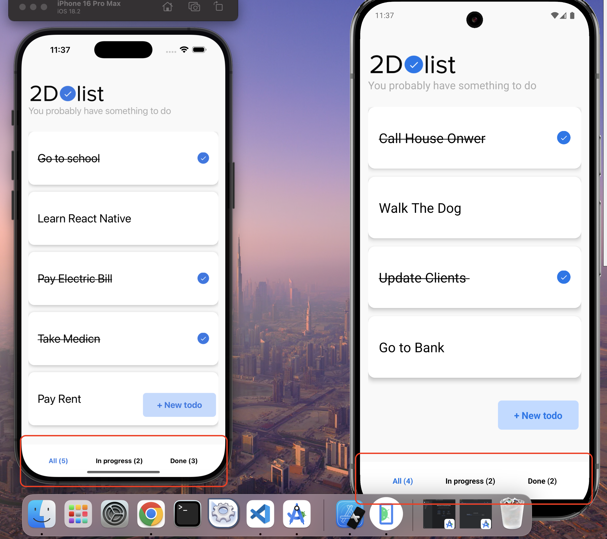

# 📝 Todo App

**Todo App** is a simple and intuitive **React Native** application designed to help users manage their daily tasks effectively. With a focus on usability and productivity, this app provides categorized task management and easy navigation.

---

## 🚀 Features

- **Add Daily Tasks**: Quickly create tasks for the day.  
- **Mark Tasks as Done**: Seamlessly mark tasks as completed with a single tap.  
- **Organize Tasks**: Navigate through:
  - **Done**: Completed tasks.
  - **In Progress**: Ongoing tasks.
  - **All**: A complete list of all tasks.
- **Delete Tasks**: Long-press any task to delete it via a confirmation popup.  
- **User-Friendly Interface**: Clean and modern design with bottom navigation for easy access.

---

## 📸 Snapshots

### 1. Add Task Screen
_Quickly add your tasks with an intuitive input field._

### 2. Bottom Navigation Tabs
_Switch between "Done," "In Progress," and "All" task lists effortlessly._

### 3. Delete Task Popup
_Long-press a task to delete it securely using a confirmation dialog._

---

## 🛠 Tech Stack

- **React Native**: Cross-platform app development.
- **React Navigation**: Smooth and intuitive tab-based navigation.
- **Custom Styling**: Clean, responsive, and modern UI built with `StyleSheet`.

---

## 🌟 Getting Started

### Prerequisites
- **Node.js** and **npm** or **yarn** installed.
- **React Native CLI** (or Expo CLI, if you're using Expo).

